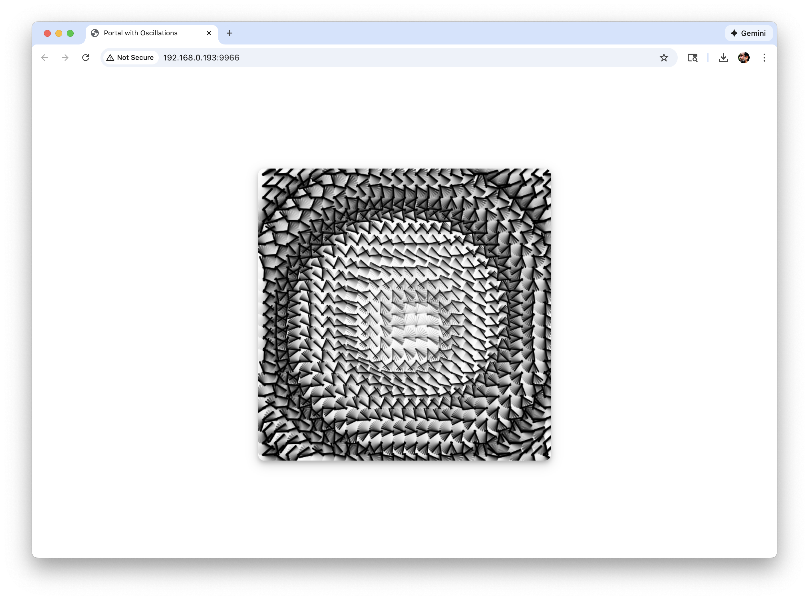

# Portal with Oscillations

A generative art piece featuring a grid of spinning lines coordinated by waves, generating a vortex effect in the center of the canvas. Built with [canvas-sketch](https://github.com/mattdesl/canvas-sketch).




## Description

Portal with Oscillations creates a mesmerizing visual effect using a grid of spinning lines that respond to wave patterns. The animation creates a vortex-like effect emanating from the center of the canvas, with lines rotating in a coordinated wave pattern.

## Features

- **Time-based animation**: Speed varies throughout the day (slow at midnight, fast at midday)
- **Interactive controls**: 
  - Click on canvas to clear background
  - Press `1-5` keys to manually control speed
  - Press `S` to save a PNG image
- **Continuous wave movement**: Smooth, flowing animation that never stops
- **Clean interface**: Minimal design focused on the animation

## Installation

1. Clone the repository:
```bash
git clone https://github.com/marlonbarrios/portalwithoscilations.git
cd portalwithoscilations
```

2. Install dependencies:
```bash
npm install
```

## Usage

**Important**: This project uses canvas-sketch and must be run via npm, not by opening `index.html` directly.

Start the development server:
```bash
npm start
```

Or use the dev command for hot reload:
```bash
npm run dev
```

The canvas-sketch server will automatically open in your browser at `http://localhost:9966`.

**Note**: Do not open `index.html` directly in the browser. Canvas-sketch uses Node.js modules (`require()`) which only work when run through the canvas-sketch CLI.

### Controls

- **Mouse Click**: Clear the background to see only the lines
- **Keys 1-5**: Manually adjust animation speed (1 = slowest, 5 = fastest)
- **Key S**: Save the current canvas as a PNG image
- **Cmd+S / Ctrl+S**: Export high-resolution PNG (canvas-sketch feature)

## Technical Details

- **Canvas Size**: 512x512 pixels
- **Grid**: 25x25 cells (625 total spinning line pairs)
- **Animation**: Continuous wave pattern with time-based speed modulation
- **Framework**: canvas-sketch for generative art workflow

## Project Structure

```
portal01/
├── sketch.js          # Main sketch code
├── package.json       # Dependencies and scripts
├── index.html         # HTML file (for reference)
├── style.css          # CSS styling
├── 1.png             # Example output image
├── libraries/         # p5.js libraries (if needed)
└── README.md          # This file
```

## Requirements

- Node.js (v12 or higher)
- npm or yarn

## License

MIT

## Author

**Marlon Barrios Solano**

- Website: [https://marlonbarrios.github.io/](https://marlonbarrios.github.io/)
- GitHub: [@marlonbarrios](https://github.com/marlonbarrios)

## Acknowledgments

Built with [canvas-sketch](https://github.com/mattdesl/canvas-sketch) by Matt DesLauriers.

